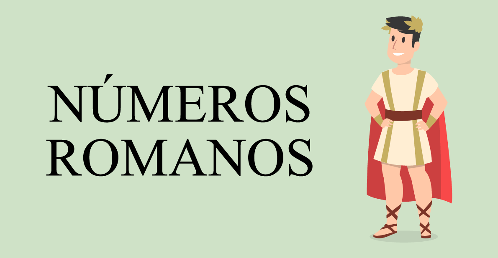

# Romans Go Home



Kata proporcionada por nuestro profesor [dfleta](https://github.com/dfleta/romans-go-home)


## Introdución

En esta Kata proporcionada por nuestro profesor de programación, nos propone realizarla utilizando los Enum Types y las Expresiones Regulares,
por ultimo nos propone implementar una nueva producción de Maven con TDD.


## Enunciado

Los romanos trajeron muchas cosas...

https://www.youtube.com/watch?v=p-fRo5-p9hE

pero admitamos que los números no eran su fuerte. Para qué los necesitaban si podían crucificar al que sabía contar.

Se trata de escribir una programa que transforme números en notación romana en notación indo-arábigo :

```
I  uno 1
II dos 2
III tres 3 
IV  cuatro 4 
V cinco 5
VI  seis 6
VII  siete 7
VIII  ocho 8
IX   nueve 9
XXXII  treinta y dos 32
XLV  cuarenta y cinco 45
```

Has de utilizar expresiones regulares y tipos enumerados. Sin utilizar estos dos recursos, el kata no se da por superado puesto que desvirtúas su propósito.